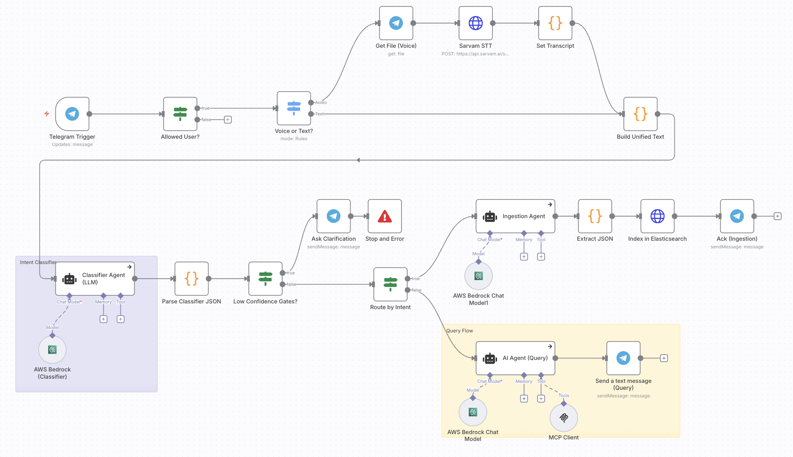
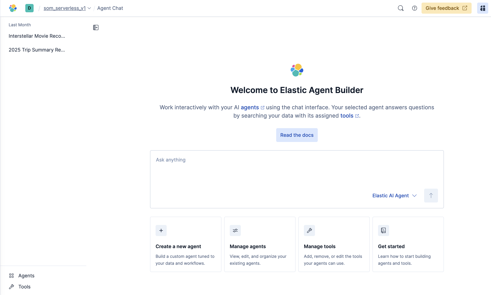
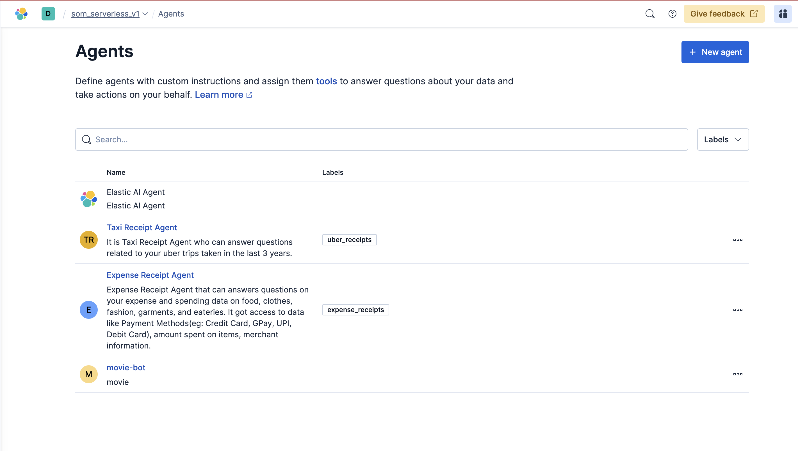
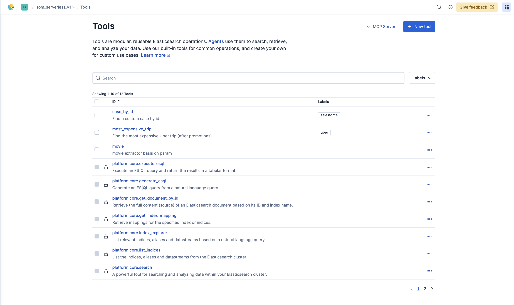
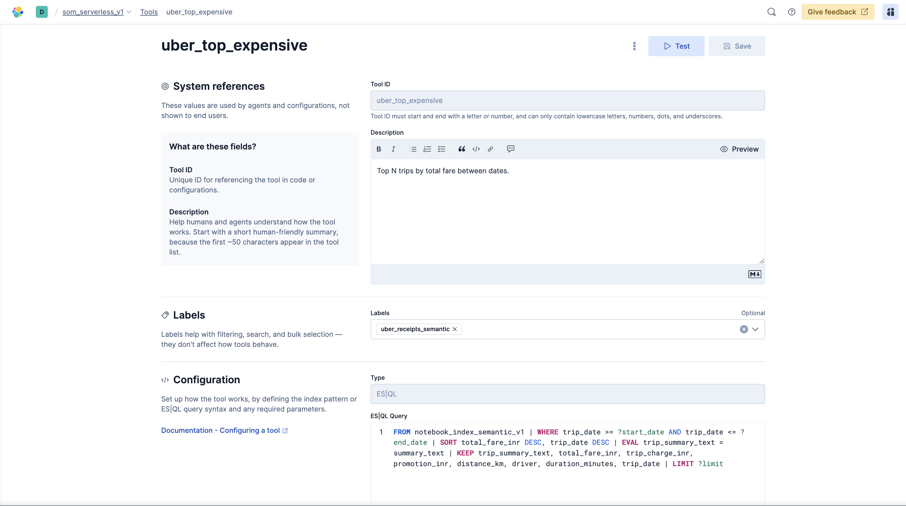

# Elasticsearch Agent Builder: Intent Classifier, Ingest & Query Pipeline - Make your data conversational!

Turn `Telegram chat` and `voice messages` into searchable knowledge using an **n8n orchestration that leverages AWS Bedrock LLMs, Elasticsearch MCP, and the Elastic Agent Builder for custom function-calling tools and retrieval workflows.**

This repository contains an architecture diagram and documentation for an automated system that connects Telegram > n8n workflow > AWS Bedrock (LLMs) > Elasticsearch, enabling both ingestion (indexing structured JSON) and conversational query flows.

## Overview

Users send messages (text or voice) to a Telegram bot. An n8n workflow receives the message, optionally transcribes audio via a `speech-to-text` service, and builds a unified text payload. That payload is sent to a classifier agent (LLM hosted via AWS Bedrock) which returns a structured JSON with the detected intent, signals, and metadata (confidence, entities, etc.). 

Based on the intent the workflow either:

#### Ingestion Flow:
1. Routes to the ingestion flow: an ingestion agent prepares a JSON document based on the Elastic Common Schema, which is then indexed into Elasticsearch with the `semantic_text` field to activate Semantic search.

#### Search Flow:
2. Routes to the query flow: an AI query agent consults `Elasticsearch MCP Server`, formats the natural language, and responds to the user in Telegram.

> `Low-confidence classifier` outputs trigger an interactive clarification step in Telegram when the confidence is below the threshold.

## Architecture 



## Components

- **Telegram**: Message entry point and user notifications.
- **n8n**: orchestrates the workflow; routing, transformations, and integrations with external APIs.
- **Speech-to-Text**: External API used to convert voice messages into text. You can use it anything of your choice. I used [Sarvam API](https://www.sarvam.ai/) for transcribing as it gave out some credits to utilize.
- **AWS Bedrock**: Hosts LLMs used for classification, ingestion agent, and query agent. I have used `Claude-3.5-Sonnet-v2`.
- **Elasticsearch for ingestion**: Persistent store for ingested documents and the primary data source for queries.
- **Elasticsearch for searching/query**: As I ingested my relevant data, I query using the Elasticsearch's hosted MCP Server.
- **Elasticsearch Agent Builder**: It's ability to create custom function callings/tools using the `ES|QL` to direct the agents.

## Low-confidence handling

- If classifier confidence < configurable threshold (e.g., 0.7), the workflow sends a clarification message to the user via Telegram and suspends processing until clarified.
- If the user fails to clarify or provides invalid input, the workflow follows an error path and optionally logs the event for review.

## Elasticsearch Agent Builder









## Edge cases & considerations

- **Audio quality**: poor audio can cause incorrect transcriptions; consider logging audio and transcript confidence.
- **LLM hallucination**: validate structured fields and use extraction/parsing steps to guard against malformed JSON.
- **Duplicate ingestion**: use stable deduplication keys (hash of content + user + timestamp) when indexing.
- **Rate limits & costs**: Bedrock and external STT services may have rate limits or usage costs—add throttling and monitoring.
- **Security**: store credentials (Telegram bot token, Elasticsearch credentials, AWS credentials) in n8n credentials manager or an encrypted secrets store. Do not commit secrets.

## How to run (high-level)

*(For complete step-by-step experience, check my [Tutorial](tutorial.md))*

This repo contains documentation, the `architecture diagram`, `n8n_workflow_scaffold` which you can import directly. For a working deployment, implement these parts:

- **n8n workflow**
   - Create the workflow shown in the diagram inside n8n.
   - Add Telegram Trigger node, allowed-user filter, STT integration, LLM agent HTTP nodes, and Elasticsearch nodes.

-. **AWS Bedrock**
   - Provision models for classification and chat (or use a single flexible model with prompts).
   - Securely store credentials and endpoints.

- **Elasticsearch**
   - Create an index with an appropriate mapping for ingested documents.

 Elasticsearch Index Mapping with `semantic_text` field enabled:
   ```
   {
  "mappings": {
    "properties": {
      "amount": {
        "type": "double"
      },
      "attachments": {
        "type": "nested",
        "properties": {
          "hash": {
            "type": "keyword"
          },
          "linked_expense_ids": {
            "type": "keyword"
          },
          "type": {
            "type": "keyword"
          },
          "url": {
            "type": "keyword"
          }
        }
      },
      "audio_hash": {
        "type": "text",
        "fields": {
          "keyword": {
            "type": "keyword",
            "ignore_above": 256
          }
        }
      },
      "category": {
        "type": "keyword"
      },
      "chat_id": {
        "type": "keyword"
      },
      "currency": {
        "type": "keyword"
      },
      "merchant": {
        "type": "keyword"
      },
      "normalized_inr": {
        "type": "double"
      },
      "note": {
        "type": "text",
        "copy_to": [
          "semantic_all"
        ]
      },
      "payment_method": {
        "type": "keyword",
        "copy_to": [
          "semantic_all"
        ]
      },
      "raw_transcript": {
        "type": "text",
        "copy_to": [
          "semantic_all"
        ]
      },
      "segments": {
        "type": "nested",
        "properties": {
          "amount": {
            "type": "double"
          },
          "category": {
            "type": "keyword"
          },
          "end_ms": {
            "type": "integer"
          },
          "merchant": {
            "type": "keyword"
          },
          "payment_method": {
            "type": "text",
            "fields": {
              "keyword": {
                "type": "keyword",
                "ignore_above": 256
              }
            }
          },
          "start_ms": {
            "type": "integer"
          },
          "text": {
            "type": "text",
            "copy_to": [
              "semantic_all"
            ]
          }
        }
      },
      "semantic_all": {
        "type": "semantic_text",
        "inference_id": "bedrock-embeddings",
        "model_settings": {
          "service": "amazonbedrock",
          "task_type": "text_embedding",
          "dimensions": 1024,
          "similarity": "cosine",
          "element_type": "float"
        }
      },
      "stt_confidence": {
        "type": "double"
      },
      "stt_model": {
        "type": "keyword"
      },
      "stt_provider": {
        "type": "keyword"
      },
      "ts": {
        "type": "date"
      },
      "user_id": {
        "type": "keyword"
      }
    }
  }
}
```

### Sample data ingested and processed via semantic_text 
```
   {
  "_index": "expenses",
  "_id": "224",
  "_version": 1,
  "_source": {
    "normalized_inr": 4500,
    "note": "Burger purchase",
    "amount": 4500,
    "user_id": "567876545",
    "merchant": "McDonald's",
    "currency": "INR",
    "category": "food",
    "raw_transcript": "Can you add my expense on McDonald's burger yesterday which is 25th of September which was Thursday and I paid via my credit card and I spent around 4500.",
    "payment_method": "credit_card",
    "chat_id": "45678456784567-iyn678",
    "ts": "2025-09-25T12:00:00+05:30"
  },
  "fields": {
    "normalized_inr": [
      4500
    ],
    "note": [
      "Burger purchase"
    ],
    "amount": [
      4500
    ],
    "semantic_all": [
      "Burger purchase",
      "credit_card",
      "Can you add my expense on McDonald's burger yesterday which is 25th of September which was Thursday and I paid via my credit card and I spent around 4500."
    ],
    "user_id": [
      "567876545"
    ],
    "merchant": [
      "McDonald's"
    ],
    "currency": [
      "INR"
    ],
    "category": [
      "food"
    ],
    "raw_transcript": [
      "Can you add my expense on McDonald's burger yesterday which is 25th of September which was Thursday and I paid via my credit card and I spent around 4500."
    ],
    "payment_method": [
      "credit_card"
    ],
    "chat_id": [
      "45678456784567-iyn678"
    ],
    "ts": [
      "2025-09-25T06:30:00.000Z"
    ]
  }
}
   ```

- **Secrets and credentials**
   - Configure Telegram bot token, Bedrock auth, STT API key, and Elasticsearch credentials in the environment or n8n credential manager.

## License

This project will be licensed under the Apache License 2.0. See [LICENSE](/LICENSE).
